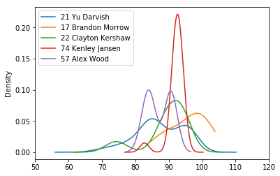
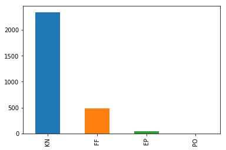
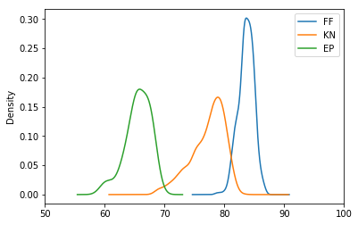
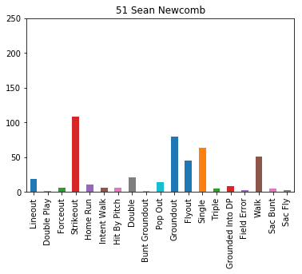

## Analyze a game: 2017 World Series - Game 7


```python
from pandas import DataFrame, read_csv
import matplotlib.pyplot as plt
import pandas as pd
import sys
import matplotlib

import baseball

%matplotlib inline
```

### All game information can be returned in a single object


```python
game_id, game = baseball.get_game_from_url('11-1-2017', 'HOU', 'LAD', 1)
```


```python
pitch_tuple_list = []
for inning in game.inning_list:
    for appearance in inning.top_half_appearance_list:
        for event in appearance.event_list:
            if isinstance(event, baseball.Pitch):
                pitch_tuple_list.append(
                    (str(appearance.pitcher), 
                     event.pitch_description,
                     event.pitch_position,
                     event.pitch_speed,
                     event.pitch_type)
                )
```


```python
data = pd.DataFrame(data=pitch_tuple_list, columns=['Pitcher', 'Pitch Description', 'Pitch Coordinate', 'Pitch Speed', 'Pitch Type'])
data
```


<div>
<style scoped>
    .dataframe tbody tr th:only-of-type {
        vertical-align: middle;
    }

    .dataframe tbody tr th {
        vertical-align: top;
    }

    .dataframe thead th {
        text-align: right;
    }
</style>
<table border="1" class="dataframe">
  <thead>
    <tr style="text-align: right;">
      <th></th>
      <th>Pitcher</th>
      <th>Pitch Description</th>
      <th>Pitch Coordinate</th>
      <th>Pitch Speed</th>
      <th>Pitch Type</th>
    </tr>
  </thead>
  <tbody>
    <tr>
      <th>0</th>
      <td>21 Yu Darvish</td>
      <td>Ball</td>
      <td>(155.47, 160.83)</td>
      <td>96.0</td>
      <td>FF</td>
    </tr>
    <tr>
      <th>1</th>
      <td>21 Yu Darvish</td>
      <td>Called Strike</td>
      <td>(107.0, 171.09)</td>
      <td>83.9</td>
      <td>FC</td>
    </tr>
    <tr>
      <th>2</th>
      <td>21 Yu Darvish</td>
      <td>In play, no out</td>
      <td>(115.36, 183.1)</td>
      <td>83.9</td>
      <td>SL</td>
    </tr>
    <tr>
      <th>3</th>
      <td>21 Yu Darvish</td>
      <td>In play, run(s)</td>
      <td>(80.06, 168.03)</td>
      <td>96.6</td>
      <td>FF</td>
    </tr>
    <tr>
      <th>4</th>
      <td>21 Yu Darvish</td>
      <td>Ball</td>
      <td>(54.1, 216.52)</td>
      <td>84.6</td>
      <td>SL</td>
    </tr>
    <tr>
      <th>5</th>
      <td>21 Yu Darvish</td>
      <td>Called Strike</td>
      <td>(130.07, 187.18)</td>
      <td>84.5</td>
      <td>SL</td>
    </tr>
    <tr>
      <th>6</th>
      <td>21 Yu Darvish</td>
      <td>Ball In Dirt</td>
      <td>(60.62, 0.0)</td>
      <td>75.0</td>
      <td>CU</td>
    </tr>
    <tr>
      <th>7</th>
      <td>21 Yu Darvish</td>
      <td>In play, run(s)</td>
      <td>(58.63, 173.43)</td>
      <td>84.7</td>
      <td>SL</td>
    </tr>
    <tr>
      <th>8</th>
      <td>21 Yu Darvish</td>
      <td>Swinging Strike</td>
      <td>(100.96, 184.09)</td>
      <td>95.7</td>
      <td>FF</td>
    </tr>
    <tr>
      <th>9</th>
      <td>21 Yu Darvish</td>
      <td>Called Strike</td>
      <td>(127.58, 185.75)</td>
      <td>84.7</td>
      <td>SL</td>
    </tr>
    <tr>
      <th>10</th>
      <td>21 Yu Darvish</td>
      <td>In play, out(s)</td>
      <td>(112.06, 164.58)</td>
      <td>87.5</td>
      <td>CH</td>
    </tr>
    <tr>
      <th>11</th>
      <td>21 Yu Darvish</td>
      <td>Called Strike</td>
      <td>(81.71, 188.54)</td>
      <td>96.1</td>
      <td>FF</td>
    </tr>
    <tr>
      <th>12</th>
      <td>21 Yu Darvish</td>
      <td>Called Strike</td>
      <td>(75.98, 184.28)</td>
      <td>96.4</td>
      <td>FF</td>
    </tr>
    <tr>
      <th>13</th>
      <td>21 Yu Darvish</td>
      <td>Ball</td>
      <td>(34.43, 160.98)</td>
      <td>69.5</td>
      <td>CU</td>
    </tr>
    <tr>
      <th>14</th>
      <td>21 Yu Darvish</td>
      <td>Ball</td>
      <td>(61.74, 179.35)</td>
      <td>86.9</td>
      <td>CH</td>
    </tr>
    <tr>
      <th>15</th>
      <td>21 Yu Darvish</td>
      <td>Foul</td>
      <td>(134.63, 142.3)</td>
      <td>85.3</td>
      <td>FC</td>
    </tr>
    <tr>
      <th>16</th>
      <td>21 Yu Darvish</td>
      <td>Foul</td>
      <td>(103.85, 198.63)</td>
      <td>85.0</td>
      <td>SL</td>
    </tr>
    <tr>
      <th>17</th>
      <td>21 Yu Darvish</td>
      <td>Ball</td>
      <td>(76.6, 184.07)</td>
      <td>96.2</td>
      <td>FF</td>
    </tr>
    <tr>
      <th>18</th>
      <td>21 Yu Darvish</td>
      <td>Foul</td>
      <td>(106.54, 163.16)</td>
      <td>85.1</td>
      <td>SL</td>
    </tr>
    <tr>
      <th>19</th>
      <td>21 Yu Darvish</td>
      <td>Foul</td>
      <td>(99.66, 170.06)</td>
      <td>83.5</td>
      <td>SL</td>
    </tr>
    <tr>
      <th>20</th>
      <td>21 Yu Darvish</td>
      <td>Foul</td>
      <td>(115.8, 181.56)</td>
      <td>84.0</td>
      <td>SL</td>
    </tr>
    <tr>
      <th>21</th>
      <td>21 Yu Darvish</td>
      <td>Foul</td>
      <td>(120.15, 169.57)</td>
      <td>95.2</td>
      <td>FF</td>
    </tr>
    <tr>
      <th>22</th>
      <td>21 Yu Darvish</td>
      <td>Foul</td>
      <td>(100.09, 210.1)</td>
      <td>86.0</td>
      <td>SL</td>
    </tr>
    <tr>
      <th>23</th>
      <td>21 Yu Darvish</td>
      <td>In play, out(s)</td>
      <td>(111.75, 193.21)</td>
      <td>95.2</td>
      <td>FF</td>
    </tr>
    <tr>
      <th>24</th>
      <td>21 Yu Darvish</td>
      <td>Called Strike</td>
      <td>(141.55, 148.99)</td>
      <td>86.8</td>
      <td>FC</td>
    </tr>
    <tr>
      <th>25</th>
      <td>21 Yu Darvish</td>
      <td>Called Strike</td>
      <td>(89.73, 168.52)</td>
      <td>76.6</td>
      <td>SL</td>
    </tr>
    <tr>
      <th>26</th>
      <td>21 Yu Darvish</td>
      <td>Ball</td>
      <td>(178.67, 140.97)</td>
      <td>95.3</td>
      <td>FF</td>
    </tr>
    <tr>
      <th>27</th>
      <td>21 Yu Darvish</td>
      <td>Ball</td>
      <td>(92.48, 156.48)</td>
      <td>78.3</td>
      <td>SL</td>
    </tr>
    <tr>
      <th>28</th>
      <td>21 Yu Darvish</td>
      <td>Foul</td>
      <td>(112.89, 180.27)</td>
      <td>82.3</td>
      <td>SL</td>
    </tr>
    <tr>
      <th>29</th>
      <td>21 Yu Darvish</td>
      <td>Foul</td>
      <td>(62.65, 181.27)</td>
      <td>85.7</td>
      <td>FC</td>
    </tr>
    <tr>
      <th>...</th>
      <td>...</td>
      <td>...</td>
      <td>...</td>
      <td>...</td>
      <td>...</td>
    </tr>
    <tr>
      <th>116</th>
      <td>74 Kenley Jansen</td>
      <td>Ball</td>
      <td>(89.68, 145.98)</td>
      <td>91.6</td>
      <td>FC</td>
    </tr>
    <tr>
      <th>117</th>
      <td>74 Kenley Jansen</td>
      <td>Ball</td>
      <td>(73.88, 177.89)</td>
      <td>92.2</td>
      <td>FC</td>
    </tr>
    <tr>
      <th>118</th>
      <td>74 Kenley Jansen</td>
      <td>Ball</td>
      <td>(131.05, 135.08)</td>
      <td>91.1</td>
      <td>FC</td>
    </tr>
    <tr>
      <th>119</th>
      <td>74 Kenley Jansen</td>
      <td>Foul</td>
      <td>(117.44, 164.54)</td>
      <td>91.7</td>
      <td>FC</td>
    </tr>
    <tr>
      <th>120</th>
      <td>74 Kenley Jansen</td>
      <td>In play, out(s)</td>
      <td>(133.07, 147.5)</td>
      <td>94.3</td>
      <td>FC</td>
    </tr>
    <tr>
      <th>121</th>
      <td>57 Alex Wood</td>
      <td>Ball</td>
      <td>(61.21, 155.78)</td>
      <td>90.0</td>
      <td>FT</td>
    </tr>
    <tr>
      <th>122</th>
      <td>57 Alex Wood</td>
      <td>Ball</td>
      <td>(98.03, 219.07)</td>
      <td>82.0</td>
      <td>CH</td>
    </tr>
    <tr>
      <th>123</th>
      <td>57 Alex Wood</td>
      <td>In play, out(s)</td>
      <td>(101.93, 165.08)</td>
      <td>89.2</td>
      <td>FT</td>
    </tr>
    <tr>
      <th>124</th>
      <td>57 Alex Wood</td>
      <td>Called Strike</td>
      <td>(81.39, 172.17)</td>
      <td>82.2</td>
      <td>KC</td>
    </tr>
    <tr>
      <th>125</th>
      <td>57 Alex Wood</td>
      <td>Ball</td>
      <td>(141.99, 196.13)</td>
      <td>83.7</td>
      <td>KC</td>
    </tr>
    <tr>
      <th>126</th>
      <td>57 Alex Wood</td>
      <td>Foul</td>
      <td>(91.95, 186.95)</td>
      <td>90.4</td>
      <td>FT</td>
    </tr>
    <tr>
      <th>127</th>
      <td>57 Alex Wood</td>
      <td>Called Strike</td>
      <td>(140.82, 176.62)</td>
      <td>91.7</td>
      <td>FT</td>
    </tr>
    <tr>
      <th>128</th>
      <td>57 Alex Wood</td>
      <td>Ball</td>
      <td>(95.9, 211.38)</td>
      <td>90.8</td>
      <td>FT</td>
    </tr>
    <tr>
      <th>129</th>
      <td>57 Alex Wood</td>
      <td>Called Strike</td>
      <td>(73.03, 190.36)</td>
      <td>90.2</td>
      <td>FT</td>
    </tr>
    <tr>
      <th>130</th>
      <td>57 Alex Wood</td>
      <td>Foul</td>
      <td>(84.89, 190.49)</td>
      <td>85.2</td>
      <td>CH</td>
    </tr>
    <tr>
      <th>131</th>
      <td>57 Alex Wood</td>
      <td>Ball</td>
      <td>(43.8, 177.46)</td>
      <td>85.1</td>
      <td>CH</td>
    </tr>
    <tr>
      <th>132</th>
      <td>57 Alex Wood</td>
      <td>Foul</td>
      <td>(60.44, 180.89)</td>
      <td>84.5</td>
      <td>CH</td>
    </tr>
    <tr>
      <th>133</th>
      <td>57 Alex Wood</td>
      <td>Foul</td>
      <td>(72.07, 152.82)</td>
      <td>83.4</td>
      <td>KC</td>
    </tr>
    <tr>
      <th>134</th>
      <td>57 Alex Wood</td>
      <td>In play, out(s)</td>
      <td>(67.4, 201.57)</td>
      <td>84.1</td>
      <td>CH</td>
    </tr>
    <tr>
      <th>135</th>
      <td>57 Alex Wood</td>
      <td>Called Strike</td>
      <td>(105.27, 166.74)</td>
      <td>90.3</td>
      <td>FT</td>
    </tr>
    <tr>
      <th>136</th>
      <td>57 Alex Wood</td>
      <td>Called Strike</td>
      <td>(119.08, 184.05)</td>
      <td>90.4</td>
      <td>FT</td>
    </tr>
    <tr>
      <th>137</th>
      <td>57 Alex Wood</td>
      <td>Called Strike</td>
      <td>(96.75, 197.82)</td>
      <td>83.7</td>
      <td>KC</td>
    </tr>
    <tr>
      <th>138</th>
      <td>57 Alex Wood</td>
      <td>Ball</td>
      <td>(96.78, 201.43)</td>
      <td>90.9</td>
      <td>FT</td>
    </tr>
    <tr>
      <th>139</th>
      <td>57 Alex Wood</td>
      <td>Ball</td>
      <td>(94.77, 203.98)</td>
      <td>83.5</td>
      <td>CH</td>
    </tr>
    <tr>
      <th>140</th>
      <td>57 Alex Wood</td>
      <td>Swinging Strike</td>
      <td>(91.42, 162.09)</td>
      <td>90.7</td>
      <td>FT</td>
    </tr>
    <tr>
      <th>141</th>
      <td>57 Alex Wood</td>
      <td>Swinging Strike</td>
      <td>(127.43, 201.74)</td>
      <td>85.0</td>
      <td>CH</td>
    </tr>
    <tr>
      <th>142</th>
      <td>57 Alex Wood</td>
      <td>Called Strike</td>
      <td>(80.18, 203.02)</td>
      <td>84.0</td>
      <td>CH</td>
    </tr>
    <tr>
      <th>143</th>
      <td>57 Alex Wood</td>
      <td>Foul</td>
      <td>(110.0, 191.95)</td>
      <td>91.0</td>
      <td>FT</td>
    </tr>
    <tr>
      <th>144</th>
      <td>57 Alex Wood</td>
      <td>Swinging Strike</td>
      <td>(103.02, 160.19)</td>
      <td>91.5</td>
      <td>FT</td>
    </tr>
    <tr>
      <th>145</th>
      <td>57 Alex Wood</td>
      <td>In play, out(s)</td>
      <td>(77.09, 193.22)</td>
      <td>84.0</td>
      <td>CH</td>
    </tr>
  </tbody>
</table>
<p>146 rows × 5 columns</p>
</div>


```python
data['Pitcher'].value_counts().plot.bar()
```


    <matplotlib.axes._subplots.AxesSubplot at 0x10621cac8>


```python
for pitcher in data['Pitcher'].unique():
    plt.ylim(0, 125)
    plt.xlim(0, 250)
    bx = [250 - x[2][0] for x in pitch_tuple_list if x[0] == pitcher if 'Ball' in x[1]]
    by = [250 - x[2][1] for x in pitch_tuple_list if x[0] == pitcher if 'Ball' in x[1]]
    cx = [250 - x[2][0] for x in pitch_tuple_list if x[0] == pitcher if 'Called Strike' in x[1]]
    cy = [250 - x[2][1] for x in pitch_tuple_list if x[0] == pitcher if 'Called Strike' in x[1]]
    ox = [250 - x[2][0] for x in pitch_tuple_list if x[0] == pitcher if ('Ball' not in x[1] and 'Called Strike' not in x[1])]
    oy = [250 - x[2][1] for x in pitch_tuple_list if x[0] == pitcher if ('Ball' not in x[1] and 'Called Strike' not in x[1])]
    b = plt.scatter(bx, by, c='b')
    c = plt.scatter(cx, cy, c='r')
    o = plt.scatter(ox, oy, c='g')

    plt.legend((b, c, o),
               ('Ball', 'Called Strike', 'Other'),
               scatterpoints=1,
               loc='upper right',
               ncol=1,
               fontsize=8)

    plt.title(pitcher)
    plt.show()
```


```python
plt.axis('equal')
data['Pitch Description'].value_counts().plot(kind='pie', radius=1.5, autopct='%1.0f%%', pctdistance=1.1, labeldistance=1.2)
```


    <matplotlib.axes._subplots.AxesSubplot at 0x1031987b8>


```python
data.dropna(inplace=True)
data.count()
data.hist()
```


    array([[<matplotlib.axes._subplots.AxesSubplot object at 0x103193be0>]], dtype=object)


```python
data.plot.kde()
```


    <matplotlib.axes._subplots.AxesSubplot at 0x10a5907b8>


```python
fig, ax = plt.subplots()
ax.set_xlim(50, 120)
for pitcher in data['Pitcher'].unique():
    s = data[data['Pitcher'] == pitcher]['Pitch Speed']
    s.plot.kde(ax=ax, label=pitcher)

ax.legend()
```


    <matplotlib.legend.Legend at 0x10c382710>





```python
fig, ax = plt.subplots()
ax.set_xlim(50, 120)
for desc in data['Pitch Type'].unique():
    s = data[data['Pitch Type'] == desc]['Pitch Speed']
    s.plot.kde(ax=ax, label=desc)

ax.legend()
```


    <matplotlib.legend.Legend at 0x10c39d550>


```python
fig, ax = plt.subplots(figsize=(15,7))
data.groupby(['Pitcher', 'Pitch Description']).size().unstack().plot.bar(ax=ax)
```


    <matplotlib.axes._subplots.AxesSubplot at 0x10c44b7f0>


```python
fig, ax = plt.subplots(figsize=(15,7))
data.groupby(['Pitcher', 'Pitch Type']).size().unstack().plot.bar(ax=ax)
```


    <matplotlib.axes._subplots.AxesSubplot at 0x10a34ccf8>


## Analyze a player's season: R.A. Dickey - 2017


```python
game_list_2017 = baseball.get_game_list_from_file_range('1-1-2017', '12-31-2017', '/Users/benjamincrom/repos/livebaseballscorecards-artifacts/baseball_files')
len(game_list_2017)
```


    3001


```python
pitch_tuple_list_2 = []
for game_id, game in game_list_2017:
    if game.home_team.name == 'Atlanta Braves' or game.away_team.name == 'Atlanta Braves':
        for inning in game.inning_list:
            for appearance in (inning.top_half_appearance_list +
                               (inning.bottom_half_appearance_list or [])):
                if 'Dickey' in str(appearance.pitcher):
                    for event in appearance.event_list:
                        if isinstance(event, baseball.Pitch):
                            pitch_tuple_list_2.append(
                                (str(appearance.pitcher), 
                                 event.pitch_description,
                                 event.pitch_position,
                                 event.pitch_speed,
                                 event.pitch_type)
                            )

len(pitch_tuple_list_2)
```


    3123


```python
df = pd.DataFrame(data=pitch_tuple_list_2, columns=['Pitcher', 'Pitch Description', 'Pitch Coordinate', 'Pitch Speed', 'Pitch Type'])
df['Pitch Type'].value_counts().plot.bar()
```


    <matplotlib.axes._subplots.AxesSubplot at 0x106226128>





```python
plt.axis('equal')
df['Pitch Description'].value_counts().plot(kind='pie', radius=2, autopct='%1.0f%%', pctdistance=1.1, labeldistance=1.2)
plt.ylabel('')
plt.show()
```


```python
df.dropna(inplace=True)
ax.set_xlim(50, 100)
df.plot.kde()
ax.legend()
```


    <matplotlib.legend.Legend at 0x10c7883c8>


```python
fig, ax = plt.subplots()
ax.set_xlim(50, 100)
for desc in df['Pitch Type'].unique():
    if desc != 'PO':
        s = df[df['Pitch Type'] == desc]['Pitch Speed']
        s.plot.kde(ax=ax, label=desc)

ax.legend()
```


    <matplotlib.legend.Legend at 0x15276ddd8>





## Analyze a lineup of pitchers: Atlanta Braves - 2017 Regular Season


```python
import datetime
import dateutil.parser
import pytz
pitch_tuple_list_3 = []
for game_id, game in game_list_2017:
    if game.home_team.name == 'Atlanta Braves' and dateutil.parser.parse(game.game_date_str) > datetime.datetime(2017, 3, 31):
        for inning in game.inning_list:
            for appearance in inning.top_half_appearance_list:
                pitch_tuple_list_3.append(
                    (str(appearance.pitcher),
                     str(appearance.batter),
                     len(appearance.out_runners_list),
                     len(appearance.scoring_runners_list),
                     len(appearance.runners_batted_in_list),
                     appearance.scorecard_summary,
                     appearance.got_on_base,
                     appearance.plate_appearance_summary,
                     appearance.plate_appearance_description,
                     appearance.error_str,
                     appearance.inning_outs)
                )
    if game.away_team.name == 'Atlanta Braves' and dateutil.parser.parse(game.game_date_str) > datetime.datetime(2017, 3, 31):
        for inning in game.inning_list:
            if inning.bottom_half_appearance_list:
                for appearance in inning.bottom_half_appearance_list:
                    pitch_tuple_list_3.append(
                        (str(appearance.pitcher),
                         str(appearance.batter),
                         len(appearance.out_runners_list),
                         len(appearance.scoring_runners_list),
                         len(appearance.runners_batted_in_list),
                         appearance.scorecard_summary,
                         appearance.got_on_base,
                         appearance.plate_appearance_summary,
                         appearance.plate_appearance_description,
                         appearance.error_str,
                         appearance.inning_outs)
                    )

df3 = pd.DataFrame(data=pitch_tuple_list_3, columns=['Pitcher',
                                                     'Batter',
                                                     'Out Runners',
                                                     'Scoring Runners',
                                                     'RBIs',
                                                     'Scorecard',
                                                     'On-base?',
                                                     'Plate Summary',
                                                     'Plate Description',
                                                     'Error',
                                                     'Inning Outs'])

```


```python
for pitcher in df3['Pitcher'].unique():
    summary = df3[df3['Pitcher'] == pitcher]['Plate Summary']
    s = summary.value_counts(sort=False)
    if len(summary) > 400:
        fig, ax = plt.subplots()
        ax.set_ylim(0, 250)
        s.plot.bar()
        plt.title(pitcher)
        plt.show()

```





```python
x = []
for pitcher in df3['Pitcher'].unique():
    #f = df3[df3['Pitcher'] == pitcher]['On-base?'].value_counts()[0]
    s = df3[df3['Pitcher'] == pitcher]['On-base?'].value_counts()
    if len(s) == 2:
        f = s[0]
        t = s[1]
        x.append((str(pitcher), f, t))

df4 = pd.DataFrame(data=x, columns=['Pitcher',
                                    'Did not get on base',
                                    'Got on base'])

```


```python
df4.index = df4['Pitcher']
df4.sort_values(by=['Got on base']).nlargest(10, 'Did not get on base').plot.bar()
```


    <matplotlib.axes._subplots.AxesSubplot at 0x15206ec18>


```python
x = []
for batter in df3['Batter'].unique():
    s = df3[df3['Batter'] == batter]['On-base?']
    if True in s.value_counts():
        t = s.value_counts()[True]
    else:
        t = 0

    if False in s.value_counts():
        f = s.value_counts()[False]
    else:
        f = 0        

    if f != 0 or t != 0:
        success = t / (f + t)
    else:
        success = None

    if f or f == 0:
        x.append((str(batter), success, t, f))

df5 = pd.DataFrame(data=x, columns=['Batter',
                                    'Success',
                                    'Got on base',
                                    'Did not get on base'])

```


```python
fig, ax = plt.subplots(figsize=(15,15))
plt.ylim(0, 70)
plt.xlim(0, 70)

lims = [0, 70]
ax.plot(lims, lims, 'k-', alpha=1.0, zorder=0, color="blue", label="OBP .500")
lims_600 = [0, 105]
ax.plot(lims, lims_600, 'k-', alpha=1.0, zorder=0, color="indigo", label="OBP .600")
lims_400 = [0, 46.667]
ax.plot(lims, lims_400, 'k-', alpha=1.0, zorder=0, color="green", label="OBP .400")
lims_300 = [0, 30]
ax.plot(lims, lims_300, 'k-', alpha=1.0, zorder=0, color="orange", label="OBP .300")
lims_200 = [0, 17.5]
ax.plot(lims, lims_200, 'k-', alpha=1.0, zorder=0, color="red", label="OBP .200")

horiz = [1, 1]
ax.plot(lims, horiz, '--', alpha=1.0, zorder=0, color="black", label="25%")
horiz = [3, 3]
ax.plot(lims, horiz, '--', alpha=1.0, zorder=0, color="black", label="50%")
horiz = [8, 8]
ax.plot(lims, horiz, '--', alpha=1.0, zorder=0, color="black", label="75%")


ax.set_aspect('equal')
ax.set_xlim(lims)
ax.set_ylim(lims)
ax.set(xlabel="Failed to get on base", ylabel="Got on base")

t = df5['Got on base']
f = df5['Did not get on base']
plt.legend()
b = plt.scatter(f, t, c='b')
plt.show()

df5.sort_values('Got on base', ascending=False)
```


<div>
<style scoped>
    .dataframe tbody tr th:only-of-type {
        vertical-align: middle;
    }

    .dataframe tbody tr th {
        vertical-align: top;
    }

    .dataframe thead th {
        text-align: right;
    }
</style>
<table border="1" class="dataframe">
  <thead>
    <tr style="text-align: right;">
      <th></th>
      <th>Batter</th>
      <th>Success</th>
      <th>Got on base</th>
      <th>Did not get on base</th>
    </tr>
  </thead>
  <tbody>
    <tr>
      <th>18</th>
      <td>21 Christian Yelich</td>
      <td>0.469880</td>
      <td>39</td>
      <td>44</td>
    </tr>
    <tr>
      <th>58</th>
      <td>16 Cesar Hernandez</td>
      <td>0.414634</td>
      <td>34</td>
      <td>48</td>
    </tr>
    <tr>
      <th>19</th>
      <td>27 Giancarlo Stanton</td>
      <td>0.361446</td>
      <td>30</td>
      <td>53</td>
    </tr>
    <tr>
      <th>49</th>
      <td>11 Ryan Zimmerman</td>
      <td>0.388889</td>
      <td>28</td>
      <td>44</td>
    </tr>
    <tr>
      <th>286</th>
      <td>13 Asdrubal Cabrera</td>
      <td>0.355263</td>
      <td>27</td>
      <td>49</td>
    </tr>
    <tr>
      <th>16</th>
      <td>9 Dee Gordon</td>
      <td>0.350649</td>
      <td>27</td>
      <td>50</td>
    </tr>
    <tr>
      <th>46</th>
      <td>6 Anthony Rendon</td>
      <td>0.382353</td>
      <td>26</td>
      <td>42</td>
    </tr>
    <tr>
      <th>63</th>
      <td>37 Odubel Herrera</td>
      <td>0.406250</td>
      <td>26</td>
      <td>38</td>
    </tr>
    <tr>
      <th>47</th>
      <td>34 Bryce Harper</td>
      <td>0.431034</td>
      <td>25</td>
      <td>33</td>
    </tr>
    <tr>
      <th>21</th>
      <td>13 Marcell Ozuna</td>
      <td>0.320000</td>
      <td>24</td>
      <td>51</td>
    </tr>
    <tr>
      <th>287</th>
      <td>19 Jay Bruce</td>
      <td>0.461538</td>
      <td>24</td>
      <td>28</td>
    </tr>
    <tr>
      <th>48</th>
      <td>20 Daniel Murphy</td>
      <td>0.359375</td>
      <td>23</td>
      <td>41</td>
    </tr>
    <tr>
      <th>294</th>
      <td>7 Jose Reyes</td>
      <td>0.297297</td>
      <td>22</td>
      <td>52</td>
    </tr>
    <tr>
      <th>17</th>
      <td>11 J.T. Realmuto</td>
      <td>0.314286</td>
      <td>22</td>
      <td>48</td>
    </tr>
    <tr>
      <th>59</th>
      <td>13 Freddy Galvis</td>
      <td>0.291667</td>
      <td>21</td>
      <td>51</td>
    </tr>
    <tr>
      <th>60</th>
      <td>23 Aaron Altherr</td>
      <td>0.381818</td>
      <td>21</td>
      <td>34</td>
    </tr>
    <tr>
      <th>300</th>
      <td>20 Neil Walker</td>
      <td>0.456522</td>
      <td>21</td>
      <td>25</td>
    </tr>
    <tr>
      <th>20</th>
      <td>41 Justin Bour</td>
      <td>0.396226</td>
      <td>21</td>
      <td>32</td>
    </tr>
    <tr>
      <th>64</th>
      <td>7 Maikel Franco</td>
      <td>0.263158</td>
      <td>20</td>
      <td>56</td>
    </tr>
    <tr>
      <th>303</th>
      <td>7 Trea Turner</td>
      <td>0.351852</td>
      <td>19</td>
      <td>35</td>
    </tr>
    <tr>
      <th>22</th>
      <td>32 Derek Dietrich</td>
      <td>0.395833</td>
      <td>19</td>
      <td>29</td>
    </tr>
    <tr>
      <th>285</th>
      <td>30 Michael Conforto</td>
      <td>0.391304</td>
      <td>18</td>
      <td>28</td>
    </tr>
    <tr>
      <th>150</th>
      <td>44 Paul Goldschmidt</td>
      <td>0.586207</td>
      <td>17</td>
      <td>12</td>
    </tr>
    <tr>
      <th>52</th>
      <td>1 Wilmer Difo</td>
      <td>0.377778</td>
      <td>17</td>
      <td>28</td>
    </tr>
    <tr>
      <th>62</th>
      <td>19 Tommy Joseph</td>
      <td>0.288136</td>
      <td>17</td>
      <td>42</td>
    </tr>
    <tr>
      <th>10</th>
      <td>26 Adam Frazier</td>
      <td>0.531250</td>
      <td>17</td>
      <td>15</td>
    </tr>
    <tr>
      <th>51</th>
      <td>32 Matt Wieters</td>
      <td>0.262295</td>
      <td>16</td>
      <td>45</td>
    </tr>
    <tr>
      <th>54</th>
      <td>3 Michael Taylor</td>
      <td>0.313725</td>
      <td>16</td>
      <td>35</td>
    </tr>
    <tr>
      <th>7</th>
      <td>10 Jordy Mercer</td>
      <td>0.516129</td>
      <td>16</td>
      <td>15</td>
    </tr>
    <tr>
      <th>96</th>
      <td>28 Tommy Pham</td>
      <td>0.517241</td>
      <td>15</td>
      <td>14</td>
    </tr>
    <tr>
      <th>...</th>
      <td>...</td>
      <td>...</td>
      <td>...</td>
      <td>...</td>
    </tr>
    <tr>
      <th>318</th>
      <td>41 John Lackey</td>
      <td>0.000000</td>
      <td>0</td>
      <td>4</td>
    </tr>
    <tr>
      <th>250</th>
      <td>55 Robert Stephenson</td>
      <td>0.000000</td>
      <td>0</td>
      <td>2</td>
    </tr>
    <tr>
      <th>255</th>
      <td>32 Stuart Turner</td>
      <td>0.000000</td>
      <td>0</td>
      <td>1</td>
    </tr>
    <tr>
      <th>272</th>
      <td>7 Raimel Tapia</td>
      <td>0.000000</td>
      <td>0</td>
      <td>2</td>
    </tr>
    <tr>
      <th>341</th>
      <td>64 Chris Flexen</td>
      <td>0.000000</td>
      <td>0</td>
      <td>1</td>
    </tr>
    <tr>
      <th>306</th>
      <td>52 Zack Godley</td>
      <td>0.000000</td>
      <td>0</td>
      <td>2</td>
    </tr>
    <tr>
      <th>169</th>
      <td>1 Steve Lombardozzi</td>
      <td>0.000000</td>
      <td>0</td>
      <td>3</td>
    </tr>
    <tr>
      <th>147</th>
      <td>33 Matt Grace</td>
      <td>0.000000</td>
      <td>0</td>
      <td>1</td>
    </tr>
    <tr>
      <th>305</th>
      <td>38 Jacob Turner</td>
      <td>0.000000</td>
      <td>0</td>
      <td>1</td>
    </tr>
    <tr>
      <th>163</th>
      <td>31 Lance Lynn</td>
      <td>0.000000</td>
      <td>0</td>
      <td>3</td>
    </tr>
    <tr>
      <th>362</th>
      <td>38 Michael Morse</td>
      <td>0.000000</td>
      <td>0</td>
      <td>2</td>
    </tr>
    <tr>
      <th>361</th>
      <td>22 Christian Arroyo</td>
      <td>0.000000</td>
      <td>0</td>
      <td>3</td>
    </tr>
    <tr>
      <th>166</th>
      <td>8 Mike Leake</td>
      <td>0.000000</td>
      <td>0</td>
      <td>3</td>
    </tr>
    <tr>
      <th>359</th>
      <td>57 Trevor Williams</td>
      <td>0.000000</td>
      <td>0</td>
      <td>2</td>
    </tr>
    <tr>
      <th>284</th>
      <td>49 Ben Lively</td>
      <td>0.000000</td>
      <td>0</td>
      <td>3</td>
    </tr>
    <tr>
      <th>357</th>
      <td>69 Danny Ortiz</td>
      <td>0.000000</td>
      <td>0</td>
      <td>6</td>
    </tr>
    <tr>
      <th>168</th>
      <td>52 Michael Wacha</td>
      <td>0.000000</td>
      <td>0</td>
      <td>3</td>
    </tr>
    <tr>
      <th>354</th>
      <td>52 Ryan Tepera</td>
      <td>0.000000</td>
      <td>0</td>
      <td>1</td>
    </tr>
    <tr>
      <th>200</th>
      <td>29 Jeff Samardzija</td>
      <td>0.000000</td>
      <td>0</td>
      <td>2</td>
    </tr>
    <tr>
      <th>170</th>
      <td>36 Edinson Volquez</td>
      <td>0.000000</td>
      <td>0</td>
      <td>2</td>
    </tr>
    <tr>
      <th>171</th>
      <td>20 Justin Nicolino</td>
      <td>0.000000</td>
      <td>0</td>
      <td>3</td>
    </tr>
    <tr>
      <th>351</th>
      <td>56 Ty Kelly</td>
      <td>0.000000</td>
      <td>0</td>
      <td>1</td>
    </tr>
    <tr>
      <th>178</th>
      <td>17 Ryan Goins</td>
      <td>0.000000</td>
      <td>0</td>
      <td>18</td>
    </tr>
    <tr>
      <th>183</th>
      <td>31 Joe Biagini</td>
      <td>0.000000</td>
      <td>0</td>
      <td>1</td>
    </tr>
    <tr>
      <th>186</th>
      <td>31 Jeff Locke</td>
      <td>0.000000</td>
      <td>0</td>
      <td>1</td>
    </tr>
    <tr>
      <th>195</th>
      <td>47 Johnny Cueto</td>
      <td>0.000000</td>
      <td>0</td>
      <td>4</td>
    </tr>
    <tr>
      <th>346</th>
      <td>76 Dillon Peters</td>
      <td>0.000000</td>
      <td>0</td>
      <td>2</td>
    </tr>
    <tr>
      <th>345</th>
      <td>50 Rafael Montero</td>
      <td>0.000000</td>
      <td>0</td>
      <td>3</td>
    </tr>
    <tr>
      <th>198</th>
      <td>45 Matt Moore</td>
      <td>0.000000</td>
      <td>0</td>
      <td>3</td>
    </tr>
    <tr>
      <th>421</th>
      <td>31 Jared Hoying</td>
      <td>0.000000</td>
      <td>0</td>
      <td>1</td>
    </tr>
  </tbody>
</table>
<p>422 rows × 4 columns</p>
</div>


